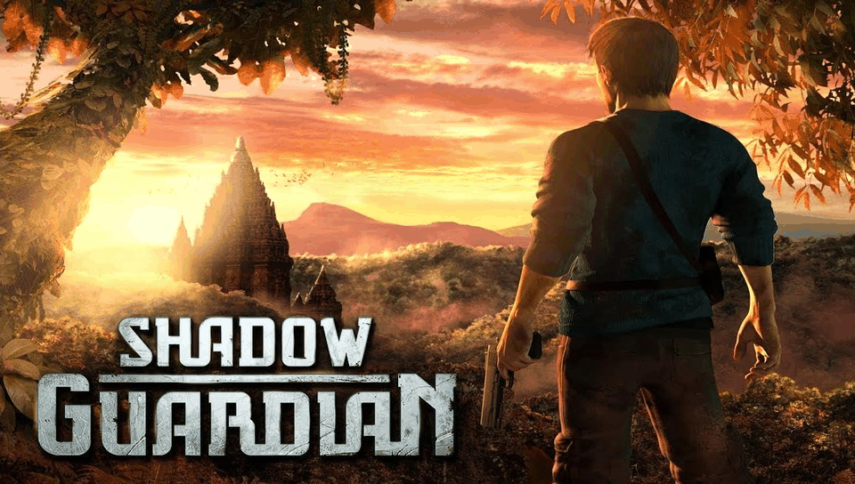

# SHADOW GUARDIAN — PS Vita Port

<p align="center">
  
</p>

<p align="center">
  <b>Native port of Shadow Guardian HD (Gameloft) for PlayStation Vita and PlayStation TV.</b>
</p>

<p align="center">
  
  
  
  
  
</p>

---

## 📖 Description

**Shadow Guardian** is Gameloft's third-person action-adventure game, originally released
for Android as `Shadow-Guardian-HD-v1-0-1-UK-RU.apk` (package
`com.gameloft.android.ANMP.GloftSGHP.ML`). This port runs the compiled native library
(`libshadowguardian.so`, armeabi-v7a) from the Android release directly on the PS Vita's
ARM Cortex-A9 processor, using a dynamic loader (*soloader*) and an Android environment
emulation layer (*FalsoJNI*), with [vitaGL](https://github.com/Rinnegatamante/vitaGL)
providing the GLES 2.0 rendering backend.

### 🎮 Current Status: Playable

The game **is fully playable from start to finish at a smooth 60 FPS**. See
[`port_progress.md`](port_progress.md) for the full bug-by-bug history.

### ✨ What Works

- **Native ARM Execution**: `libshadowguardian.so` (armeabi-v7a) runs directly on the
  Vita's CPU via the soloader, no interpretation/emulation of game code.
  (`libStormGLOFT.so`, Gameloft's runtime OpenGL hooker, is intentionally omitted —
  vitaGL handles rendering instead.)
- **Boots to Title + In-Game**: Full JNI lifecycle bootstrap matching the real Android
  `Activity` order (`JNI_OnLoad` → `nativeGetInfo` → `GLResLoader.nativeInit` →
  `Device.nativeInit` → `GameRenderer.nativeInit` → `ShadowGuardian.nativeInit` →
  `GameRenderer.nativeResize`), then a continuous `GameRenderer.nativeRender()` loop.
- **vitaGL Graphics Pipeline**: GLES 2.0 rendering through a natively built vitaGL
  (built from `lib/vitagl`, with error-handling guards kept enabled so the engine's
  bloom/blur render-target setup behaves like real drivers instead of crashing).
- **Audio**: The engine's Vox software mixer output is routed to Vita's PCM audio
  (`sceAudioOut`, 44100 Hz stereo, double-buffered mixer on core 1). Music and SFX
  work, including loop/pitch/volume/stop commands.
- **Input**: Touch controls plus mapped physical buttons and both analog sticks.
  Touch is forwarded to `GameGLSurfaceView.nativeOnTouch`; keys go through
  `ShadowGuardian.nativeOnKeyDown/Up`.
- **Assets from `ux0:`**: Path redirection maps the engine's
  `/sdcard/gameloft/games/GloftSGHP` and `/data/data/...` paths to
  `ux0:data/shadowguardian/`.
- **DRM bypassed**: Gameloft license check (`ALicenseCheck_ValidateLicense`) is patched out.
- **Shader fixes bundled**: The 3 engine shaders Android drivers silently tolerate but
  Shark does not (`interactible_basic.xml`, `interactible_bump.xml`,
  `interactible_shadowmap.xml`) ship inside the VPK under `shader_patches/` and are
  installed automatically on boot — no manual file swapping needed.

### 🕹️ Controls

| Vita input | Action |
|---|---|
| Left Analog | Movement (in-game) |
| Right Analog | Camera (free-look, continuous drag — light tilt for slow/precise aim, full tilt for fast 360°) |
| D-Pad | Menu navigation / movement |
| R | Fire |
| L | Aim (hold) |
| Cross | Contextual action (jump / run / climb) |
| Circle | Grab / interact |
| Square | Switch weapon |
| Start | Pause / back |
| Select | Toggle virtual buttons (hide/show touch controls) |
| Touch screen | Original touch controls |

### ⚠️ Known Issues

- **Shader cache history**: three different-looking crashes across v1.2.1–v1.2.5 turned
  out to be one root cause (the `interactible_*` shaders above failing to compile on
  Shark, plus vitaGL's on-disk cache reader/writer not tolerating failed compiles).
  All three layers are fixed as of v1.2.5 — cache reads tolerate corrupt files, failed
  compiles are never written to the cache, and the corrected shaders ship in the VPK.
- **Beta bugs**: occasional UI quirks may remain — see the bug log in
  [`port_progress.md`](port_progress.md). If you hit one, grab a console log
  (`ux0:data/shadowguardian/logs/`): it is the fastest way to trace it instead of guessing.

---

## 📋 Prerequisites

To run this port on your PS Vita or PS TV, you will need:

1. A PS Vita / PS TV console running Custom Firmware (**HENkaku** or **Enso**),
   firmware 3.60/3.65 or later recommended.
2. [**kubridge**](https://github.com/TheOfficialFloW/kubridge/releases) and
   [**FdFix**](https://github.com/TheOfficialFloW/FdFix/releases) installed as
   kernel plugins (`ur0:tai/config.txt` under `*KERNEL`).
3. [**libshacccg.suprx**](https://github.com/Rinnegatamante/ShaRKBR33D/releases/latest)
   installed in `ur0:data/`.
4. A legally obtained copy of **Shadow Guardian HD v1.0.1**
   (`Shadow-Guardian-HD-v1-0-1-UK-RU.apk`,
   package `com.gameloft.android.ANMP.GloftSGHP.ML`).

---

## 📦 Installation Instructions

1. Install the `shadowguardian.vpk` file on your console using **VitaShell**.
2. On your PC, extract `Shadow-Guardian-HD-v1-0-1-UK-RU.apk` with any zip extractor
   (or place the APK in the project root as `shadowguardian_extract/`).
3. Copy the native library `libshadowguardian.so` (from `lib/armeabi-v7a/` inside the
   APK) to `ux0:data/shadowguardian/`.
4. Copy the game data folders (`res`, `shaders`, `text`, `music`, `sounds`, `models`,
   `anims`, `collisions`, `textures`, `video`, `levels`, `gui_1_6`, `gui_1_7`,
   `sprites_1_6`, `sprites_1_7`, etc.) to `ux0:data/shadowguardian/`. Make sure the
   16:9 assets (`sprites_1_7`, `gui_1_7`) are present, copying from the `_1_6`
   fallback if missing.
5. Use **psvita-port-toolkit** (the standalone tool this port is managed with) to
   prepare and transfer the asset files to your console — open the toolkit and
   select "Continuar con un port existente" pointing at this folder.

### Final File Structure in `ux0:data/shadowguardian/`

```text
ux0:data/shadowguardian/
├── libshadowguardian.so   <- Native library from lib/armeabi-v7a/ in the APK
├── res/ shaders/ text/    <- Game data folders from the APK / data dump
├── music/ sounds/ models/ <- (anims, collisions, textures, video, levels,
│                              gui_1_6, gui_1_7, sprites_1_6, sprites_1_7, ...)
├── logs/                  <- Incremental debug logs (shadowguardian_NNN.log)
└── cg/ glsl/              <- Shader cache (created at runtime/build)
```

---

## 🛠️ Building from Source

This port does **not** keep a local copy of `porting_tools/` — all build, deploy,
log, LiveArea, and crash-dump workflows are handled by **psvita-port-toolkit**, a
standalone tool kept outside this repository.

### Build Prerequisites

- **VitaSDK**, fully compiled with softfp usage (`vitasdk-softfp/vdpm`).
- VitaSDK libraries: `vitaGL`, `vitashark`, `kubridge`, `pthread`.
- CMake and Make.

### Build Steps

```bash
cmake -Bbuild .
cmake --build build
```

This produces `build/shadowguardian.vpk`. For day-to-day development (build + deploy +
crash-dump parsing), use **psvita-port-toolkit** instead of raw `cmake`/`make`.

---

## 🏗️ Project Structure

- `source/`: Native C/C++ loader (lifecycle, GLES rendering, audio, input, JNI
  resource loader, video, path/license patches).
- `lib/`: Auxiliary libraries (`so_util`, `falso_jni`, `libc_bridge`, `fios`,
  `kubridge`, `sha1`, vendored `vitagl` built from source).
- `extras/`: LiveArea assets (`icon0.png`, `bg0.png`, `pic0.png`, `startup.png`,
  `template.xml`), plus `cpuinfo`/`meminfo`, `shader_patches/` (the 3 fixed
  `interactible_*` shaders) and debug scripts.
- `PORTING_PLAN.md`: Living plan — engine findings, JNI export table, checklist.
- `port_progress.md`: Bug-by-bug diagnosis log, one confirmed bug at a time.

---

## ⚖️ Disclaimer

**Shadow Guardian** is a registered trademark of Gameloft. The work presented in this
repository is not "official" or produced or sanctioned by Gameloft or any other
registered trademark mentioned in this repository.

This software does not contain the original code, executables, assets, or other
non-redistributable parts of the original game product. The authors of this work
do not promote or condone piracy in any way. To launch and play the game on their
PS Vita device, users must possess their own legally obtained copy of the game in
the form of an `.apk` file.

---

## 👥 Credits and Acknowledgements

- **Gameloft**: Original developers of Shadow Guardian.
- **TheFloW**: For `so_util`, `kubridge`, `FdFix`, and foundational techniques for
  loading Android executables on PS Vita.
- **Rinnegatamante**: For `vitaGL` and continued support to the PS Vita porting scene.
- **v-atamanenko**: For `FalsoJNI` and the `soloader-boilerplate` base template.
- **Vita Community**: To all developers and enthusiasts in the PS Vita homebrew community.

---

## License

This software may be modified and distributed under the terms of the MIT license.
See the [LICENSE](LICENSE) file for details.
